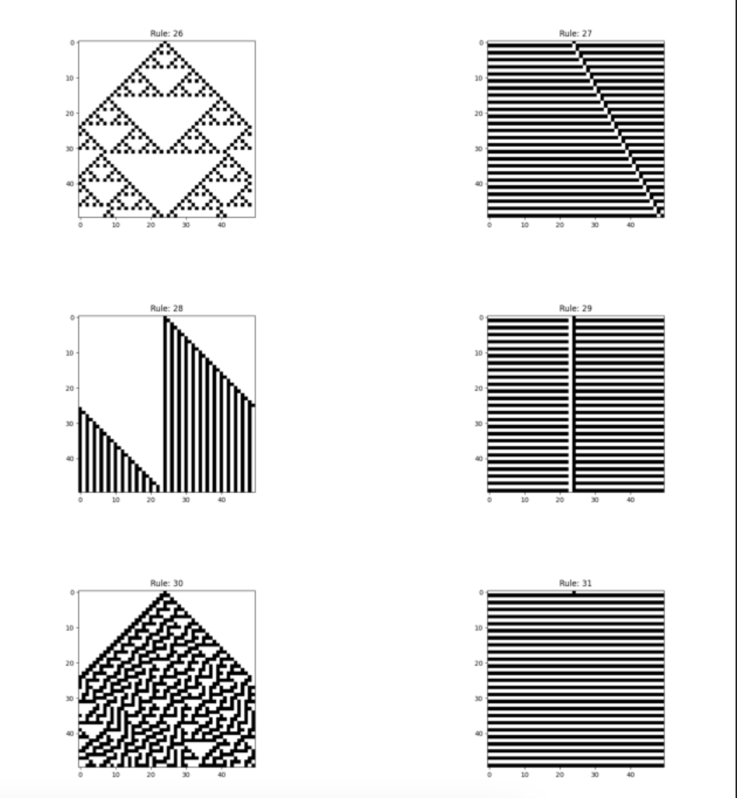

# Elementary_Cell_Automaton
このリポジトリは、初等セルオートマトンのシミュレーションを行い、その結果を画像として保存し、最終的にPDFにまとめるPythonスクリプトを含んでいます。

## ファイル構成

- `eca_simulation.py`: 初等セルオートマトンのシミュレーションを行うモジュールです。ルール番号に基づいてセルの状態を更新し、シミュレーション結果を画像として保存します。
- `eca_pdf.py`: シミュレーションで生成された画像をPDFにまとめるモジュールです。指定されたフォルダ内の画像を自然順にソートし、指定されたレイアウトでPDFに保存します。
- `main.py`: シミュレーションを実行し、画像を生成し、最終的にPDFにまとめるメインスクリプトです。

## 使用方法

### 依存関係のインストール

このプロジェクトを実行するには、以下のPythonライブラリが必要です：

```bash
pip install matplotlib tqdm
```

## 実行結果
このスクリプトによって出力されるPDFの一例です。
